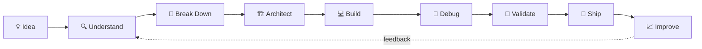
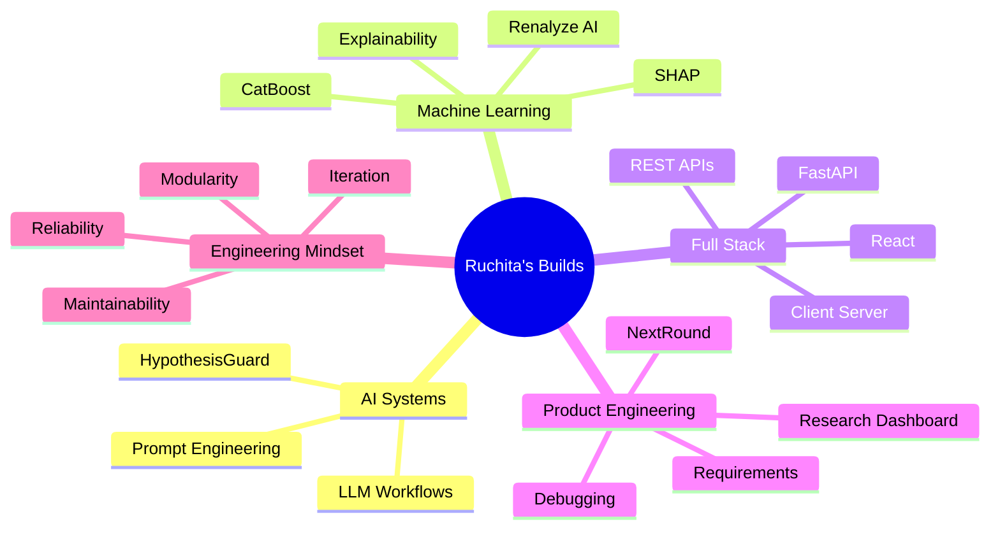
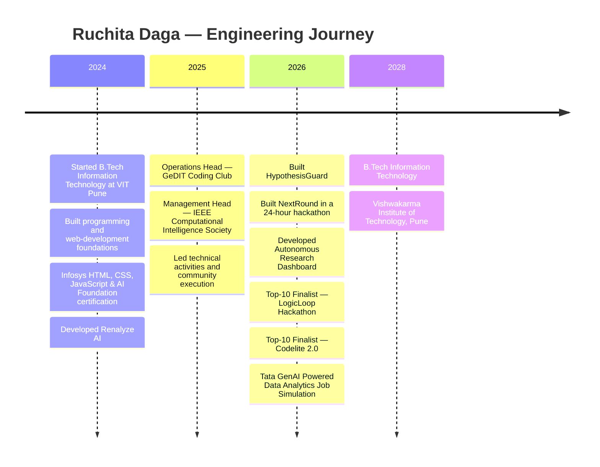

<div align="center">

<!-- ═══════════════════════════════════════════════════════════════════════ -->

<!--                         R U C H I T A   D A G A                         -->

<!-- ═══════════════════════════════════════════════════════════════════════ -->


<br/>


 

<a href="https://www.linkedin.com/in/ruchitadaga/">

</a>

 

<a href="https://github.com/RuchitaDaga">

</a>

 

<a href="mailto:ruchitadaga09@gmail.com">

</a>

<br/><br/>

### `I don't just write code. I turn ambiguity into systems.`

</div>

---

# ⚡ `INITIALIZING RUCHITA.exe`

```text
╔════════════════════════════════════════════════════════════════════╗
║                         SYSTEM BOOT LOG                            ║
╠════════════════════════════════════════════════════════════════════╣
║  USER .............. Ruchita Daga                                 ║
║  ROLE .............. Software Developer                           ║
║  BASE .............. Pune, Maharashtra                            ║
║  UNIVERSITY ........ Vishwakarma Institute of Technology          ║
║  DEGREE ............ B.Tech — Information Technology              ║
║  GPA ............... 9.21 / 10                                    ║
║                                                                    ║
║  CORE MODULES ...... Full-Stack Development                       ║
║                     AI / Machine Learning                          ║
║                     REST API Engineering                           ║
║                     Problem Solving                                ║
║                     Debugging                                      ║
║                                                                    ║
║  DSA ENGINE ........ 300+ problems solved                         ║
║  HACKATHON MODE .... 2× Top-10 Finalist                           ║
║  LEADERSHIP MODE ... 200+ member technical community              ║
║                                                                    ║
║  STATUS ............ BUILDING ████████████████████ 100%            ║
╚════════════════════════════════════════════════════════════════════╝
```

---

<div align="center">

# 🪐 Welcome to my Developer Universe

**Ideas enter as questions.
They leave as interfaces, APIs, models, workflows, and working products.**

</div>



> My favorite part of engineering is somewhere between
> **“this should work”** and **“now I know exactly why it didn't.”**

---

# 🧬 `ruchita.config.ts`

```ts
const ruchita = {
  identity: {
    name: "Ruchita Daga",
    role: "Software Developer",
    degree: "B.Tech — Information Technology",
    university: "Vishwakarma Institute of Technology, Pune",
    graduation: 2028,
    gpa: 9.21
  },

  engineering: {
    languages: [
      "Java",
      "Python",
      "C++",
      "C",
      "JavaScript",
      "TypeScript",
      "SQL"
    ],

    frontend: [
      "React.js",
      "Next.js",
      "Vite",
      "Tailwind CSS"
    ],

    backend: [
      "FastAPI",
      "REST APIs",
      "Client-Server Systems"
    ],

    databases: [
      "PostgreSQL",
      "MySQL",
      "MongoDB",
      "Supabase"
    ],

    intelligenceLayer: [
      "Machine Learning",
      "Deep Learning",
      "NLP",
      "CatBoost",
      "SHAP",
      "LLMs",
      "Prompt Engineering"
    ]
  },

  proofOfWork: {
    dsaProblems: "300+",
    hackathonFinals: "2 × Top-10",
    communityLed: "200+ members",
    participationGrowth: "30%+"
  },

  operatingPrinciple:
    "Understand deeply → build clearly → debug patiently → ship reliably"
};
```

---

# 🎯 Mission Control

<div align="center">

<table>
<tr>
<td align="center" width="25%">

### `9.21`

**GPA / 10**

🎓
Academic consistency
meets engineering curiosity

</td>

<td align="center" width="25%">

### `300+`

**DSA Problems**

🧠
Patterns over
memorization

</td>

<td align="center" width="25%">

### `TOP 10 × 2`

**Hackathons**

🏆
Building fast
under pressure

</td>

<td align="center" width="25%">

### `200+`

**Community**

👥
Leadership beyond
the IDE

</td>
</tr>
</table>

</div>

---

# 🔥 What Makes My Profile Different?

```text
Most projects start with:
"Wouldn't it be cool if...?"

Mine usually continue with:
"Okay — what architecture would actually make that work?"
```

I enjoy working across the complete product path:

```text
User Problem
     │
     ▼
Requirement Analysis
     │
     ├───────────────┐
     ▼               ▼
Frontend          Backend
React             FastAPI
Next.js           REST APIs
     │               │
     └───────┬───────┘
             ▼
       Data / AI Layer
     ML • LLMs • SQL
             │
             ▼
     Integration Testing
             │
             ▼
      Root-Cause Debugging
             │
             ▼
         SHIPPED 🚀
```

---

# 🚀 The Build Vault

<div align="center">

### `04 systems • different problems • one engineering mindset`

</div>

---

<table>
<tr>
<td width="50%" valign="top">

<h2 align="center">🧠 HypothesisGuard</h2>

<p align="center">
<b>AI Research & Innovation Copilot</b>
</p>

<p align="center">


</p>

### The problem

Great project ideas often die somewhere between:

```text
idea → research → validation → implementation
```

because the path from **“I have an idea”** to **“I know what to build”** is messy.

### The build

HypothesisGuard converts rough concepts into **research-backed, build-ready project plans**.

Its workflow structures evidence, requirements, implementation steps, and development milestones instead of producing disconnected AI responses.

### Engineering signal

`requirements → evidence → structured reasoning → roadmap`

> **Less:** “Here are some ideas.”
> **More:** “Here is what you can actually build next.”

</td>

<td width="50%" valign="top">

<h2 align="center">🩺 Renalyze AI</h2>

<p align="center">
<b>CKD Risk Prediction & Progression System</b>
</p>

<p align="center">


</p>

### The problem

A prediction without explanation is just a number.

### The build

Developed an end-to-end CKD risk prediction application using a **43-feature clinical dataset**.

The CatBoost model achieved:

<div align="center">

## `99.8% accuracy`

</div>

SHAP-based explanations expose feature-level contributions so predictions can be interpreted instead of treated as black boxes.

### Architecture

```text
Clinical Features
      ↓
Preprocessing
      ↓
CatBoost Model
      ↓
SHAP Explainability
      ↓
FastAPI
      ↓
React Interface
      ↓
Prediction + Report
```

</td>
</tr>

<tr>
<td width="50%" valign="top">

<h2 align="center">🎙️ NextRound</h2>

<p align="center">
<b>AI-Powered Mock Interview Platform</b>
</p>

<p align="center">


</p>

### Challenge accepted

```text
TIME AVAILABLE
████████████████████████ 24 HOURS

FEATURES TO BUILD
████████████████████████ MANY

PRODUCTION BUG BEFORE DEMO
████████████████████████ OF COURSE
```

Built a full-stack **voice-based interview platform** with real-time interaction and a feedback dashboard during a 24-hour hackathon.

### The debugging story

A production-blocking API integration issue threatened end-to-end functionality before the final demo.

Instead of patching symptoms:

```text
observe
  ↓
reproduce
  ↓
trace request flow
  ↓
find root cause
  ↓
fix integration
  ↓
verify end-to-end
```

Functionality restored.

Demo delivered.

### `Pressure → Debugging → Execution`

</td>

<td width="50%" valign="top">

<h2 align="center">🔭 Autonomous Research Dashboard</h2>

<p align="center">
<b>SaaS-Style Research Workspace</b>
</p>

<p align="center">


</p>

### Built for expansion

A research dashboard designed around modularity rather than one-off UI screens.

### Modules

```text
┌────────────────────────────┐
│  AUTONOMOUS RESEARCH HUB   │
├────────────────────────────┤
│  ◉ Dashboard               │
│  ◉ Routing                 │
│  ◉ Watchlists              │
│  ◉ Report Comparison       │
│  ◉ API Data Integration    │
│  ◉ AI Automation Flows     │
└────────────────────────────┘
```

Reusable React components and structured routing make the application easier to extend as new workflows are introduced.

### Philosophy

`Build features today without making tomorrow painful.`

</td>
</tr>
</table>

---

# 🧪 Project DNA



---

# 🧠 Algorithm Arena

<div align="center">


</div>

<br/>

```text
                   PROBLEM SOLVING PIPELINE

           ┌─────────────────────────┐
           │       NEW PROBLEM       │
           └────────────┬────────────┘
                        │
                        ▼
              Understand constraints
                        │
                        ▼
               Find brute force
                        │
                        ▼
               Identify pattern
                        │
              ┌─────────┴─────────┐
              ▼                   ▼
         Data Structure       Algorithm
              │                   │
              └─────────┬─────────┘
                        ▼
                 Optimize logic
                        │
                        ▼
                 Handle edges
                        │
                        ▼
                    ACCEPTED
                        │
                        ▼
                      +1 ✅
```

### My DSA philosophy

```diff
- memorize 1000 solutions
+ recognize reusable patterns

- chase only accepted submissions
+ understand why the solution works

- fear edge cases
+ hunt them before they hunt me
```

---

# 🏆 Hackathon Signal

<div align="center">


&nbsp;


<br/><br/>

### `Constraints don't kill creativity. They reveal it.`

</div>

Hackathons compressed the complete engineering cycle:

```text
IDEA
 ↓
TEAM ALIGNMENT
 ↓
PRIORITIZATION
 ↓
BUILD
 ↓
INTEGRATION
 ↓
SOMETHING BREAKS
 ↓
DEBUG
 ↓
DEMO
 ↓
LEARN
 ↓
REPEAT
```

Two competitions.

Two Top-10 finalist finishes.

One recurring lesson:

> **Shipping under constraints is a different skill from coding without them.**

---

# 👑 Leadership Layer

<div align="center">

## `code executes instructions — teams require communication`

</div>

<table>
<tr>
<td width="50%" valign="top">

### ⚙️ Operations Head

**GeDIT Coding Club**
Vishwakarma Institute of Technology

`Aug 2025 → Apr 2026`

Led operations for a technical community of:

<div align="center">

# `200+ MEMBERS`

</div>

Coordinated:

* technical activities
* coding sessions
* workshops
* logistics
* planning
* cross-team execution
* faculty communication

The role taught me that successful technical work depends just as much on **coordination and clarity** as implementation.

</td>

<td width="50%" valign="top">

### 🧠 Management Head

**IEEE Computational Intelligence Society**
VIT Pune

`Aug 2025 → Apr 2026`

Spearheaded coding competitions and DSA workshops while working across teams and stakeholders.

<div align="center">

# `30%+ ↑`

### participation growth

</div>

A practical lesson in:

```text
planning
   +
communication
   +
execution
   =
impact
```

</td>
</tr>
</table>

---

# ⚙️ Technology Constellation

<div align="center">

### Languages


<br/><br/>

### Frontend


<br/><br/>

### Backend + Data


<br/><br/>

### Developer Tools


</div>

<br/>

<div align="center">


</div>

---

# 🗂️ `engineering_stack.json`

```json
{
  "programming": {
    "primary": ["Java", "Python", "C++"],
    "web": ["JavaScript", "TypeScript"],
    "systems_foundation": ["C"],
    "data": ["SQL"]
  },

  "product_engineering": {
    "frontend": ["React.js", "Next.js", "Vite", "Tailwind CSS"],
    "backend": ["FastAPI", "REST APIs"],
    "architecture": ["Client-Server Applications", "API Integration"]
  },

  "databases": [
    "PostgreSQL",
    "MySQL",
    "MongoDB",
    "Supabase"
  ],

  "ai_ml": [
    "Machine Learning",
    "Deep Learning",
    "NLP",
    "CatBoost",
    "SHAP",
    "LLMs",
    "Prompt Engineering"
  ],

  "engineering_process": [
    "Requirements Analysis",
    "Functional Solution Design",
    "Root-Cause Debugging",
    "Git",
    "Cross-Functional Collaboration"
  ]
}
```

---

# 🕹️ Developer Skill Tree

```text
                              RUCHITA
                                 │
             ┌───────────────────┼───────────────────┐
             │                   │                   │
             ▼                   ▼                   ▼
      SOFTWARE DEV            AI / ML          PROBLEM SOLVING
             │                   │                   │
      ┌──────┼──────┐       ┌────┼────┐        ┌────┼─────┐
      ▼      ▼      ▼       ▼    ▼    ▼        ▼    ▼     ▼
    React FastAPI  SQL      ML   NLP  LLMs     DSA  Debug  Logic
      │      │                 │
      ▼      ▼                 ▼
     UI     APIs             CatBoost
      │      │                 │
      └──┬───┘                 ▼
         ▼                    SHAP
   Full-Stack Apps         Explainability
```

---

# 🗺️ Build Timeline



---

# 🎓 Academic Core

<div align="center">

### Vishwakarma Institute of Technology, Pune

## `B.Tech — Information Technology`

`2024 — 2028`

<br/>


</div>

<br/>

| Stage                            | Institution                               |       Performance |
| :------------------------------- | :---------------------------------------- | ----------------: |
| 🎓 B.Tech Information Technology | Vishwakarma Institute of Technology, Pune | **9.21 / 10 GPA** |
| 📘 Higher Secondary — Class XII  | CS Kothari, Nandura                       |         **86.5%** |
| 📗 Secondary — Class X           | SSJMES, Nandura                           |         **94.5%** |

---

# 📜 Achievement Registry

```text
╭──────────────────────────────────────────────────────────╮
│                 ACHIEVEMENTS UNLOCKED                    │
├──────────────────────────────────────────────────────────┤
│                                                          │
│  🧠  300+ DSA Problems                                   │
│      └── LeetCode                                        │
│                                                          │
│  🏆  Top-10 Finalist                                     │
│      └── LogicLoop Hackathon 2026                        │
│                                                          │
│  🏆  Top-10 Finalist                                     │
│      └── Codelite 2.0 Hackathon 2026                     │
│                                                          │
│  📜  GenAI Powered Data Analytics                        │
│      └── Tata via Forage • Jan 2026                      │
│                                                          │
│  📜  HTML • CSS • JavaScript • AI Foundation             │
│      └── Infosys • 2024                                  │
│                                                          │
╰──────────────────────────────────────────────────────────╯
```

---

# 🔬 Engineering Principles

<table>
<tr>
<td width="33%" align="center">

## 01

### Understand First

I prefer finding the actual requirement before reaching for a framework.

`problem > technology`

</td>

<td width="33%" align="center">

## 02

### Debug the Cause

A workaround can hide a bug.

Root-cause debugging teaches you the system.

`symptom ≠ cause`

</td>

<td width="33%" align="center">

## 03

### Build for Change

Clean structure matters because today's demo can become tomorrow's product.

`working → maintainable`

</td>
</tr>

<tr>
<td width="33%" align="center">

## 04

### Connect the Pieces

Frontend, backend, APIs, models and data are useful only when the complete flow works.

`components → system`

</td>

<td width="33%" align="center">

## 05

### Measure Impact

Scores, participation, accuracy and outcomes make engineering results tangible.

`build → validate`

</td>

<td width="33%" align="center">

## 06

### Keep Iterating

The first version proves the idea.

The next versions prove the engineer.

`v1 → v2 → better`

</td>
</tr>
</table>

---

# 🎮 Debugging Simulator

```python
while software_is_not_working:

    reproduce_bug()

    assumptions = question_everything()

    trace = inspect_data_flow()

    root_cause = isolate_failure(trace)

    fix(root_cause)

    if end_to_end_test() == "PASS":
        ship()
        break
```

```text
Developer XP gained:
+ requirements analysis
+ API debugging
+ client-server integration
+ persistence
+ caffeine resistance
```

---

# 🔍 If You Look Through My Repositories...

You are likely to find some combination of:

```text
React components
FastAPI routes
ML pipelines
SQL queries
AI workflows
API calls
hackathon experiments
DSA implementations
half-finished debugging comments
and one bug that definitely "worked yesterday"
```

<div align="center">

<a href="https://github.com/RuchitaDaga?tab=repositories">

</a>

</div>

---

# 📊 GitHub Telemetry

<div align="center">


<br/><br/>


<br/><br/>


</div>

---

# 🏅 Trophy Cabinet

<div align="center">


</div>

---

# 🌌 Contribution Universe

<div align="center">

### Every green square has a story.

Some are features.

Some are fixes.

Some are:

`"why is this undefined?"`

</div>

<br/>

<div align="center">

<picture>
  <source
    media="(prefers-color-scheme: dark)"
    srcset="https://raw.githubusercontent.com/RuchitaDaga/RuchitaDaga/output/github-contribution-grid-snake-dark.svg">
  <source
    media="(prefers-color-scheme: light)"
    srcset="https://raw.githubusercontent.com/RuchitaDaga/RuchitaDaga/output/github-contribution-grid-snake.svg">
  
</picture>

</div>

<details>

<summary><b>🐍 Click here to activate the contribution snake</b></summary>

<br/>

Create:

```text
.github/workflows/snake.yml
```

Add:

```yaml
name: Generate Contribution Snake

on:
  schedule:
    - cron: "0 0 * * *"

  workflow_dispatch:

  push:
    branches:
      - main

jobs:
  generate:
    permissions:
      contents: write

    runs-on: ubuntu-latest

    steps:
      - name: Generate contribution snake
        uses: Platane/snk/svg-only@v3
        with:
          github_user_name: ${{ github.repository_owner }}
          outputs: |
            dist/github-contribution-grid-snake.svg
            dist/github-contribution-grid-snake-dark.svg?palette=github-dark

      - name: Publish to output branch
        uses: crazy-max/ghaction-github-pages@v3
        with:
          build_dir: dist
          target_branch: output
        env:
          GITHUB_TOKEN: ${{ secrets.GITHUB_TOKEN }}
```

After committing it:

```text
GitHub
   ↓
Actions
   ↓
Generate Contribution Snake
   ↓
Run Workflow
   ↓
🐍 unlocked
```

</details>

---

# 📡 Current Signal

```bash
ruchita@github:~$ cat focus.txt

[ACTIVE]  software development
[ACTIVE]  full-stack engineering
[ACTIVE]  AI-powered applications
[ACTIVE]  DSA & problem solving
[ACTIVE]  building systems that actually work

ruchita@github:~$ cat engineering_mindset.txt

> understand before implementing
> debug before blaming
> simplify before adding
> test before celebrating
> learn after shipping

ruchita@github:~$ echo $NEXT

bigger problems.
better systems.
cleaner solutions.
```

---

# 🛰️ Signal Strength

```text
FULL-STACK ENGINEERING
████████████████████░░░░

PROBLEM SOLVING
█████████████████████░░░

AI / ML SYSTEMS
██████████████████░░░░░░

API INTEGRATION
████████████████████░░░░

ROOT-CAUSE DEBUGGING
████████████████████░░░░

LEADERSHIP
███████████████████░░░░░

CURIOSITY
████████████████████████
```

---

# 🧭 My Engineering Compass

<div align="center">

```text
                         IMPACT
                           ▲
                           │
                           │
             CLARITY ◄─────┼─────► CREATIVITY
                           │
                           │
                           ▼
                       RELIABILITY
```

### Build creative things.

### But make them understandable.

### Make them work.

### Make them matter.

</div>

---

# 💬 Things You Can Talk to Me About

<div align="center">


</div>

---

# 🔐 Source Code of My Mindset

```java
public class RuchitaDaga {

    private boolean curiosity = true;
    private boolean givesUp = false;

    public void solve(Problem problem) {

        while (!problem.isSolved()) {

            problem.understand();

            Solution idea = problem.breakIntoSmallerPieces();

            idea.implement();

            if (idea.hasBug()) {
                idea.debugRootCause();
            }

            idea.test();
            idea.improve();
        }

        problem.ship();
    }

    public String nextGoal() {
        return "Become better than yesterday's version.";
    }
}
```

---

# 🪄 The Non-Technical Stack

```yaml
human_stack:

  curiosity:
    status: always_on

  communication:
    used_for:
      - teams
      - stakeholders
      - technical communities

  leadership:
    experience:
      - GeDIT Coding Club
      - IEEE Computational Intelligence Society

  resilience:
    tested_by:
      - hackathons
      - integration bugs
      - deadlines

  learning:
    mode: continuous

  favorite_feature:
    "turning confusion into clarity"
```

---

# 🎓 Certifications

<div align="center">

<table>
<tr>
<td align="center">

### 📊 Tata

**GenAI Powered Data Analytics**

Forage
`January 2026`

</td>

<td align="center">

### 💻 Infosys

**HTML • CSS • JavaScript**

**AI Foundation**

`2024`

</td>
</tr>
</table>

</div>

---

# 🧩 The Ruchita Equation

<div align="center">

## `Curiosity + Logic + Code + Persistence = Better Systems`

<br/>

```text
             CURIOSITY
                 +
               LOGIC
                 +
                CODE
                 +
            PERSISTENCE
                 │
                 ▼
        ┌───────────────────┐
        │  RUCHITA BUILDS   │
        └───────────────────┘
```

</div>

---

# 📬 Open Communication Port

<div align="center">

### `PORT 443: collaboration endpoint available`

Have an interesting software problem?

Building something ambitious?

Want to discuss full-stack engineering, AI, DSA, or hackathons?

<br/>

<a href="https://www.linkedin.com/in/ruchitadaga/">

</a>

 

<a href="mailto:ruchitadaga09@gmail.com">

</a>

 

<a href="https://github.com/RuchitaDaga">

</a>

<br/><br/><br/>

```text
ruchita@future:~$ git status

On branch: becoming-better

Changes to be committed:
  + stronger engineering fundamentals
  + better system design
  + harder problems
  + smarter products
  + more things worth building

nothing to fear, keep shipping.
```

<br/>

## `while(alive) { learn(); build(); debug(); improve(); }`

<br/>


</div>

<!--
╔════════════════════════════════════════════════════════════════════╗
║                     END OF PROFILE README                          ║
║                                                                    ║
║     If you're reading the source, we're probably both nerds.       ║
║                         Respect. 🤝                                ║
╚════════════════════════════════════════════════════════════════════╝
-->
