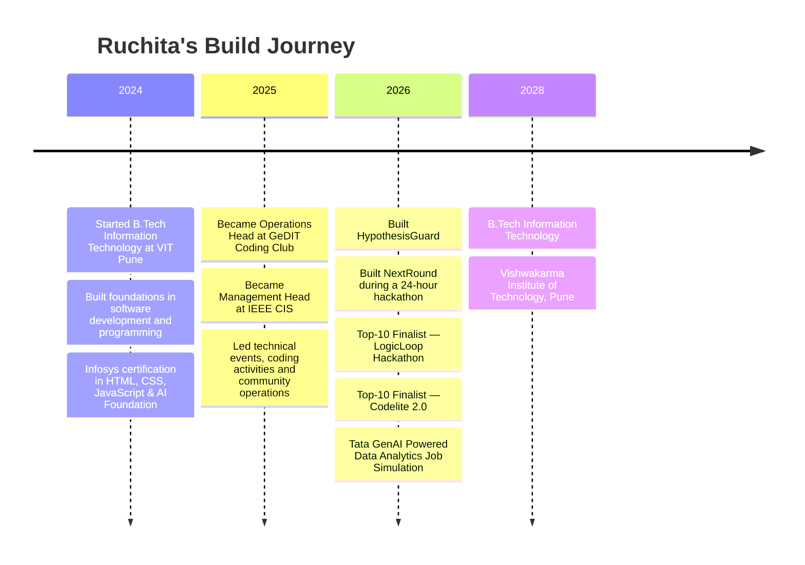

<div align="center">


[](https://github.com/RuchitaDaga)

<br/>


&nbsp;
[](https://www.linkedin.com/in/ruchitadaga/)
&nbsp;
[](https://github.com/RuchitaDaga)
&nbsp;
[](mailto:ruchitadaga09@gmail.com)

</div>

---

## 👋 Hello, World!

```javascript
const ruchita = {
    role: "Software Developer",
    degree: "B.Tech — Information Technology",
    university: "Vishwakarma Institute of Technology, Pune",
    graduation: 2028,

    languages: [
        "Java",
        "Python",
        "C++",
        "C",
        "JavaScript",
        "TypeScript",
        "SQL"
    ],

    buildingWith: [
        "React.js",
        "Next.js",
        "FastAPI",
        "PostgreSQL",
        "MongoDB",
        "AI / ML"
    ],

    interests: [
        "Full-Stack Engineering",
        "AI-powered Products",
        "Machine Learning",
        "Problem Solving",
        "Scalable Software"
    ],

    stats: {
        GPA: "9.21 / 10",
        DSA: "300+ problems",
        hackathons: "2× Top-10 finalist",
        communityLeadership: "200+ members"
    },

    mindset: "Understand → Design → Build → Debug → Improve"
};
```

I enjoy building software where **clean engineering meets intelligent systems** — from full-stack products and REST APIs to machine-learning applications and AI-powered workflows.

For me, development is not just about making something *work*.

It is about understanding the problem, designing the right flow, debugging what breaks, and shipping something people can actually use.

---

## ⚡ At a Glance

<div align="center">

| 🎓 Academics | 🧠 Problem Solving | 🏆 Hackathons | 👥 Leadership |
|:---:|:---:|:---:|:---:|
| **9.21 / 10 GPA** | **300+ DSA Problems** | **2× Top-10 Finalist** | **200+ Member Community** |
| B.Tech IT @ VIT Pune | LeetCode | LogicLoop & Codelite 2.0 | Operations Head |

</div>

---

## 🧩 What I Build

<div align="center">


</div>

<br/>

```text
                     ┌──────────────────┐
                     │   USER / IDEA    │
                     └────────┬─────────┘
                              ↓
                    ┌────────────────────┐
                    │ REQUIREMENTS       │
                    │ ANALYSIS           │
                    └────────┬───────────┘
                             ↓
          ┌──────────────────┴──────────────────┐
          ↓                                     ↓
 ┌─────────────────┐                   ┌─────────────────┐
 │   FRONTEND      │                   │    BACKEND      │
 │ React / Next.js │                   │ FastAPI / APIs  │
 └────────┬────────┘                   └────────┬────────┘
          │                                     │
          └──────────────────┬──────────────────┘
                             ↓
                    ┌─────────────────┐
                    │   DATA / AI     │
                    │ SQL • ML • LLMs │
                    └────────┬────────┘
                             ↓
                    ┌─────────────────┐
                    │ DEBUG • TEST    │
                    │ ITERATE • SHIP  │
                    └─────────────────┘
```

---

# 🚀 Featured Builds

> A few projects that represent how I approach software:  
> **understand the problem → design the workflow → build the system → solve what breaks.**

<table>
<tr>
<td width="50%" valign="top">

### 🧠 HypothesisGuard
#### AI Research & Innovation Copilot

`React` `LLMs` `Vercel` `AI Workflows`

An AI copilot designed to transform **rough ideas into research-backed, build-ready project plans**.

Built a source-linked evidence review workflow that helps move from an initial hypothesis toward structured implementation roadmaps and actionable development milestones.

**What I worked on**
- AI-assisted research workflows
- Requirement-to-solution translation
- Structured project planning
- Evidence-backed outputs
- Production deployment

</td>

<td width="50%" valign="top">

### 🩺 Renalyze AI
#### CKD Risk Prediction & Progression System

`Python` `CatBoost` `SHAP` `FastAPI` `React.js`

An end-to-end machine-learning application for **clinical risk prediction and explainability**.

Built using a **43-feature clinical dataset**, with CatBoost achieving **99.8% prediction accuracy** and SHAP providing feature-level model explanations.

Connected the ML pipeline to a FastAPI backend and React frontend for real-time predictions and automated reporting.

**Highlights**
- 43 clinical features
- 99.8% model accuracy
- Explainable AI with SHAP
- Full client-server workflow

</td>
</tr>

<tr>
<td width="50%" valign="top">

### 🎙️ NextRound
#### AI-Powered Mock Interview Platform

`Full-Stack` `Voice Interaction` `APIs` `Dashboard`

A voice-based mock-interview experience created during a **24-hour hackathon**.

Built real-time interview interaction and a feedback dashboard while working against a strict deadline.

When production-blocking API integration issues appeared before the demo, I traced the underlying problem through **root-cause debugging** and restored reliable end-to-end functionality.

**Built in:** `24 hours ⚡`

</td>

<td width="50%" valign="top">

### 🔬 Autonomous Research Dashboard
#### SaaS-Style Research Workspace

`React` `Vite` `Tailwind CSS` `JavaScript` `Axios`

A modular research dashboard designed around **maintainability and future feature expansion**.

Implemented reusable React components and workflows for research-oriented functionality.

**Features**
- Modular dashboard architecture
- Routing
- Watchlists
- Report comparison
- API-driven interfaces
- AI automation workflows

</td>
</tr>
</table>

<div align="center">

[](https://github.com/RuchitaDaga?tab=repositories)

</div>

---

# 🛠️ Developer Toolkit

### Languages

<div align="center">


</div>

### Frontend & Web

<div align="center">


</div>

### Backend & Databases

<div align="center">


</div>

### Development Tools

<div align="center">


</div>

### AI / ML / Data

<div align="center">


</div>

---

# 🧠 Engineering DNA

```yaml
problem_solving:
  approach:
    - understand the requirement
    - break the problem into components
    - design the workflow
    - implement incrementally
    - debug the root cause
    - improve reliability

software_engineering:
  - software design & development
  - REST API integration
  - client-server architecture
  - functional solution implementation
  - requirements analysis
  - root-cause debugging
  - version control with Git

favorite_intersection:
  "Software Engineering × AI × Real-World Problem Solving"
```

---

# 🏆 Competitive Coding & Achievements

<div align="center">


&nbsp;


</div>

<br/>

```text
DSA Progress
━━━━━━━━━━━━━━━━━━━━━━━━━━━━━━━━━━━━━━━━━━━━━━
Arrays & Strings       █████████████████░░░
Linked Lists           █████████████████░░░
Stacks & Queues        ████████████████░░░░
Trees & Graphs         ███████████████░░░░░
Dynamic Programming    ████████████░░░░░░░░
Problem Solving        300+ problems and counting
━━━━━━━━━━━━━━━━━━━━━━━━━━━━━━━━━━━━━━━━━━━━━━
```

> Competitive programming taught me that the first solution is rarely the best one —  
> understand the constraints, optimize deliberately, and keep iterating.

---

# 👥 Beyond the Code

Software is a team sport.

My college leadership experiences have given me opportunities to work not only with code, but also with **people, deadlines, coordination, communication, and execution**.

<table>
<tr>
<td width="50%" valign="top">

### ⚙️ Operations Head
**GeDIT Coding Club — VIT Pune**

`Aug 2025 – Apr 2026`

Led end-to-end operations for a technical community of **200+ members**.

Worked across teams on:

- Event planning
- Logistics
- Technical activities
- Coding sessions
- Workshops
- Cross-functional coordination
- Faculty communication

</td>

<td width="50%" valign="top">

### 🧠 Management Head
**IEEE Computational Intelligence Society — VIT Pune**

`Aug 2025 – Apr 2026`

Spearheaded coding competitions and DSA workshops while coordinating team planning and stakeholder communication.

The initiatives contributed to a **30%+ increase in participation**.

</td>
</tr>
</table>

---

# 📍 My Journey



---

# 🎓 Education

### Vishwakarma Institute of Technology, Pune

**B.Tech — Information Technology**  
`2024 → 2028`

```text
Current GPA  →  9.21 / 10
```

### Academic Background

| Qualification | Institution | Score |
|---|---|---:|
| B.Tech — Information Technology | Vishwakarma Institute of Technology, Pune | **9.21 / 10** |
| Class XII — HSC | CS Kothari, Nandura | **86.5%** |
| Class X — SSC | SSJMES, Nandura | **94.5%** |

---

# 📜 Certifications

<div align="center">


&nbsp;


</div>

<br/>

**GenAI Powered Data Analytics Job Simulation**  
Tata via Forage · January 2026

**HTML, CSS, JavaScript and AI Foundation**  
Infosys · 2024

---

# 📊 GitHub Activity

<div align="center">


<br/><br/>


<br/><br/>


</div>

---

# 🏅 GitHub Trophies

<div align="center">

[](https://github.com/ryo-ma/github-profile-trophy)

</div>

---

# 🐍 Contributions in Motion

<div align="center">

<p>
Because apparently committing code wasn't enough.<br/>
Now the snake gets the contributions too. 🐍
</p>

<picture>
  <source
    media="(prefers-color-scheme: dark)"
    srcset="https://raw.githubusercontent.com/RuchitaDaga/RuchitaDaga/output/github-contribution-grid-snake-dark.svg">
  <source
    media="(prefers-color-scheme: light)"
    srcset="https://raw.githubusercontent.com/RuchitaDaga/RuchitaDaga/output/github-contribution-grid-snake.svg">
  
</picture>

</div>

<details>
<summary><b>⚙️ Enable the contribution snake</b></summary>

<br/>

Create:

```text
.github/workflows/snake.yml
```

Then add:

```yaml
name: Generate Contribution Snake

on:
  schedule:
    - cron: "0 0 * * *"

  workflow_dispatch:

  push:
    branches:
      - main

jobs:
  generate:
    permissions:
      contents: write

    runs-on: ubuntu-latest

    steps:
      - name: Generate snake
        uses: Platane/snk/svg-only@v3
        with:
          github_user_name: ${{ github.repository_owner }}
          outputs: |
            dist/github-contribution-grid-snake.svg
            dist/github-contribution-grid-snake-dark.svg?palette=github-dark

      - name: Push snake to output branch
        uses: crazy-max/ghaction-github-pages@v3
        with:
          build_dir: dist
          target_branch: output
        env:
          GITHUB_TOKEN: ${{ secrets.GITHUB_TOKEN }}
```

Go to **Actions → Generate Contribution Snake → Run workflow** once after adding the file.

</details>

---

# 💭 How I Think About Building

```text
A good project shouldn't just look impressive in a demo.

It should:

✓ solve the right problem
✓ have understandable architecture
✓ survive real debugging
✓ communicate clearly through the UI
✓ connect its components reliably
✓ remain maintainable after the hackathon ends
```

That is the engineering mindset I'm continuing to build.

---

# 🤝 Let's Connect

<div align="center">

### Have an interesting idea, engineering problem, or collaboration?

<br/>

[](https://www.linkedin.com/in/ruchitadaga/)
&nbsp;
[](https://github.com/RuchitaDaga)
&nbsp;
[](mailto:ruchitadaga09@gmail.com)

<br/><br/>

```text
ruchita@github:~$ ./next-challenge

> learning...
> building...
> debugging...
> improving...
> shipping. 🚀
```

<br/>

### `"Build with curiosity. Debug with patience. Improve with every iteration."`


</div>
